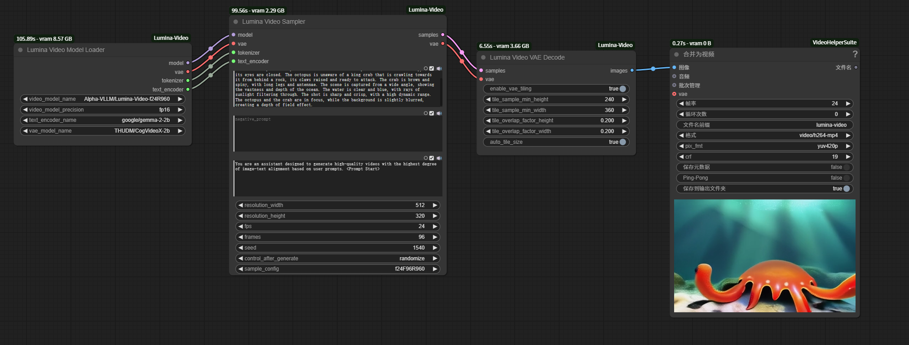

# ComfyUI-Lumina-Video

这是一个用于ComfyUI的基于 [Lumina Video](https://github.com/Alpha-VLLM/Lumina-Video) 模型的视频生成非官方插件实现。

## 功能特点

- 支持文本到视频的生成
- 支持自定义分辨率和帧率（宽高都必须为32的倍数）
- 支持自定义系统提示词和负面提示词
- 支持多种精度模式 (bf16/fp16/fp32)
- 自动下载并管理所需模型

## 安装方法

1. 确保已安装 ComfyUI
2. 克隆本仓库到 ComfyUI 的 custom_nodes 目录：
```bash
cd ComfyUI/custom_nodes
git clone https://github.com/greengerong/ComfyUI-Lumina-Video.git

pip install -r requirements.txt
```
3. 重启ComfyUI，模型将在首次运行时自动下载。手动下载模型，则可用网盘下载并与本地models目录合并。网盘地址：[https://pan.quark.cn/s/7663d2202040](https://pan.quark.cn/s/7663d2202040)。
    * [Lumina-Video-f24R960](https://huggingface.co/Alpha-VLLM/Lumina-Video-f24R960) :下载模型并发至目录 /ComfyUI/models/Lumina-Video/Lumina-Video-f24R960
    * [gemma-2-2b](https://huggingface.co/google/gemma-2-2b/tree/main) :下载模型并发至目录 /ComfyUI/models/LLM/gemma-2-2b
    * [CogVideoX-2b vae](https://huggingface.co/THUDM/CogVideoX-2b/tree/main/vae) :下载vae目录模型并发至目录 /ComfyUI/models/CogVideo/CogVideoX-2b

## 使用方法
工作流见[./comfyui/workflows/Lumina-Video.json](./comfyui/workflows/Lumina-Video.json)



## 联系我


## 致谢

- [Lumina Video](https://github.com/Alpha-VLLM/Lumina-Video)
- [ComfyUI](https://github.com/comfyanonymous/ComfyUI)
